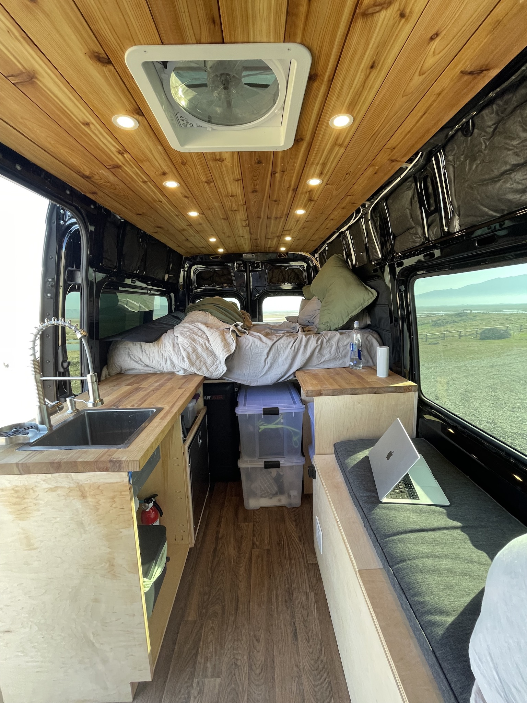
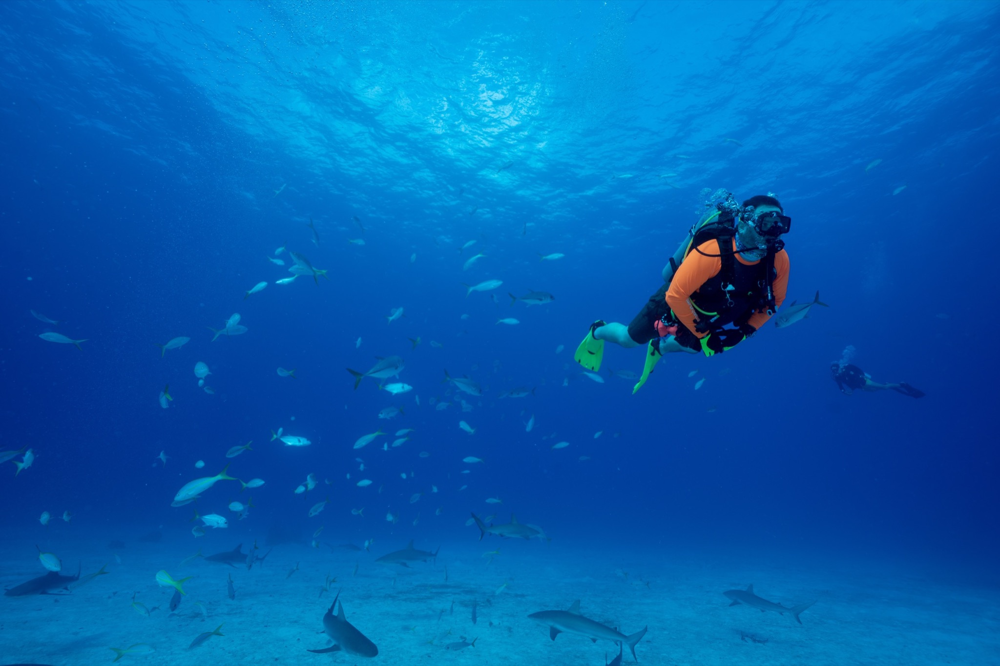
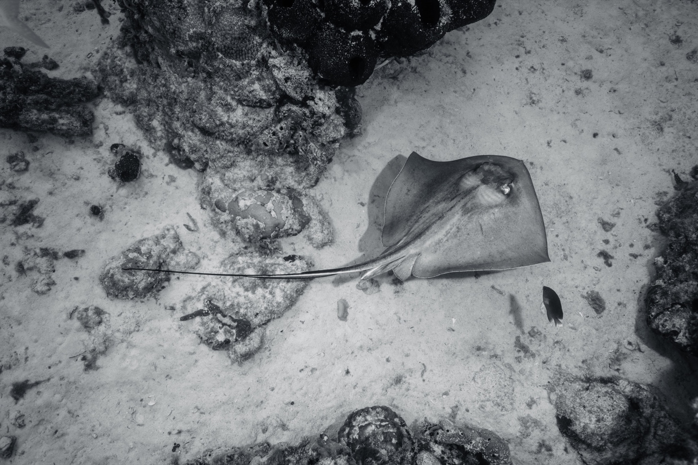
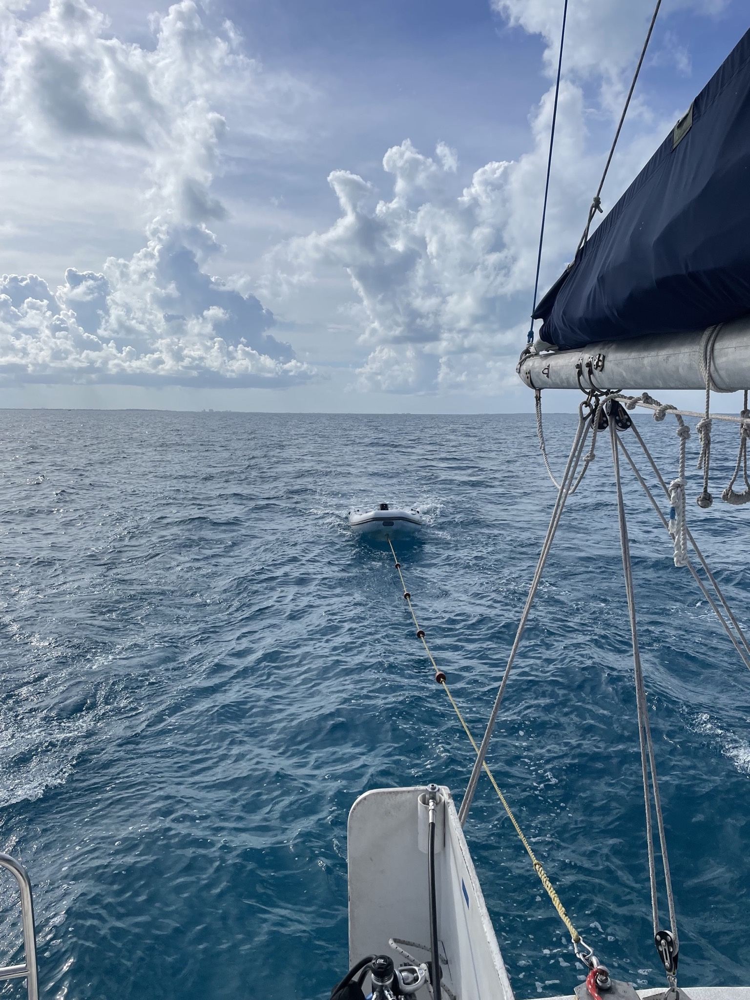
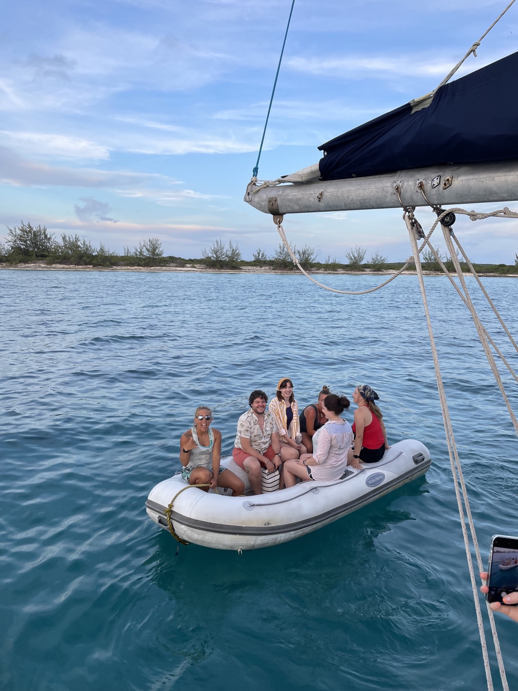
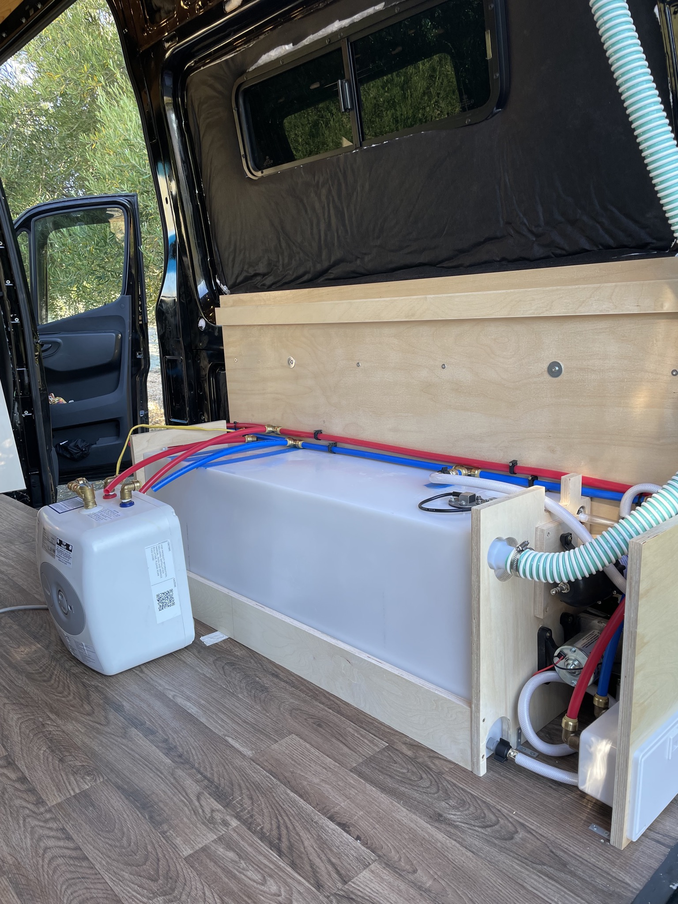
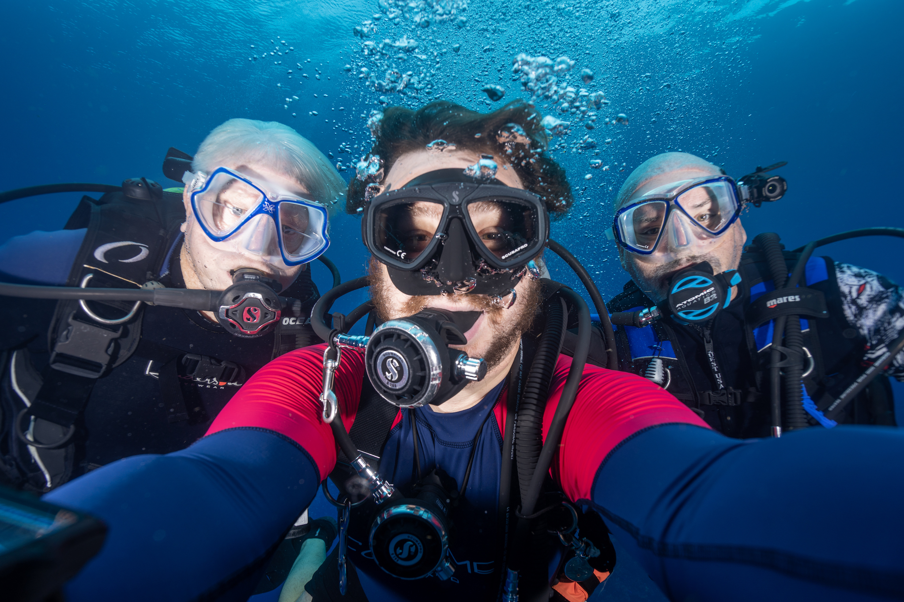

# 2022

This year was a unique year. I started the year without a job or a place to live. My house in San Francisco just sold, so I had house money in my checking account. Now what?

Here's a video I recorded when I moved out.

<iframe width="620" height="348" src="https://www.youtube.com/embed/tY8EKN_Yttg" title="YouTube video player" frameborder="0" allow="accelerometer; autoplay; clipboard-write; encrypted-media; gyroscope; picture-in-picture" allowfullscreen></iframe>

## Tulum

Some friends were going to Tulum, Mexico and asked if I wanted to tag along. Booked my tickets on my phone and slept on the couch in their Airbnb.

<photo-gallery>
  <photo-row>
    
    
  </photo-row>
</photo-gallery>

Two of the four others were divers and wanted to try diving in [cenotes](https://en.wikipedia.org/wiki/Cenote). I said I'd never done it and wasn't that excited about it, but since I love diving, let's do it.

<photo-gallery>
  <photo-row>
    
  </photo-row>
</photo-gallery>

It was incredible.

A few minutes into the dive, I remember saying to myself "This is incredible. I need to get cave certified." When we surfaced, my friend Chad exclaimed, "This is the coolest thing I've ever done!" Totally agree.

We saw super old Mayan pottery, some fossils, and a [halocline](https://en.wikipedia.org/wiki/Halocline). Absolutely incredible.

## Picking Vanlife

After I got back from Mexico in mid-January, I was sitting in an Airbnb outside of Santa Cruz, CA trying to figure out what I'm doing with my life. The rough plan was to travel full time, but everything I thought of sounded boring or lonely.

<photo-gallery>
  <photo-row>
    
    
  </photo-row>
</photo-gallery>

My good friend, Oren, suggested roadtripping to Baja. That sounded like fun. Something to do at least.

At the time, I had an electric car so I knew getting to Cabo would be really difficult or impossible. I was considering getting a 4Runner or a truck or something with a rooftop tent. A friend (probably Oren) suggested building a van instead.

In the summer of 2020, I build a small camper van for my mom and most of 2020–2021 remodeling my house, so I felt like I sorta knew what this would entail. I decided to go for it. Mainly as something to do. I still wasn't that excited about traveling by myself, but building a van sounded fun.

I hadn't really watched much vanlife content, but I was aware people did it, and it sounded fun.

I remember Oren saying something like, "you won't know it's lonely until you try it." So alright, let's get a van.

## Getting the Van

In my Airbnb in Santa Cruz, I started searching for vans. From some quick research, it seemed like most people had Sprinters and there were lots of aftermarket things for them, so I decided to get a Sprinter. All of the dealers I called said they had a waitlist of hundreds and didn't even want my name. Hah. Alright.

On craigslist, I started looking in cities I could get to. I found one that used to be a cupcake concession van in Indianapolis. Seemed good. It was an auction, so I bid on it. Woke up the next morning and had an email that I won! I only had 4 days to drive 2,300 miles. Went to my storage unit, picked up all of my camping & scuba gear, and then hit the road.

2,300 miles is a lot of miles in an EV. It was fine though.

When I showed up, the van was definitely pink.

<photo-gallery>
  <photo-row>
    
  </photo-row>
</photo-gallery>

I was so pumped for it.

The next day when I got to look at it more closely, I realized it was not in great shape like the listing said. Lots of rust and other issues.

So, I sold that van and bought a different one in Boston the next week.

<photo-gallery>
  <photo-row>
    
  </photo-row>
</photo-gallery>

That van would become my home.

I named that van Curiosity, after the spacecraft. Seemed fitting since it was a rover and all. (I named the pink one Cupcake. RIP.)

Curiosity is a 2019 Sprinter 1500 144WB with a high roof. It's gasoline and gets ~16mpg.

## Building the Van

I purchased my van (When I say my van from here on out, I mean Curiosity.) on February 1st.

When you don't live somewhere, the most difficult part of building a van is having somewhere to build it. I originally started at my aunt's house, but turns out I'm super allergic to one of her cats. (The other cat was fine. So weird.)

A few weeks later, I moved to a rental property a friend from high school had that was empty. Drove up to IKEA and bought furniture for it for like $1,200. I love IKEA.

I figured since I was going to be there for a few months, I might as well be comfortable. Just got a bed, couch, and dining table.

Mid-February through end then of April, I built my van. Basically nonstop. Most days, I'd work at least 12 hours on it. Even on the weekend.

My friend, Nick, was getting married in Portland, OR the first weekend in May and I wanted to be in the van when I went. Nick used to live in a van and was super helpful answering a bunch of questions when I was getting started with my build. I thought it would be cool to finish it by then.

At the beginning of April, that was starting to get stressful. I definitely considered flying and then coming back to work on the van. Then I decided, to just get done what I get done and head out May 1st.

<photo-gallery>
  <photo-row>
    
    
  </photo-row>
  <photo-row>
    
    
  </photo-row>
</photo-gallery>

That turned out to be a great decision. Getting on the road and living in the van full time was incredible. I didn't think I'd like it as much as I do. Also helped to focus what things to work on next.

<photo-gallery>
  <photo-row>
    
  </photo-row>
  <photo-row>
    
    
  </photo-row>
</photo-gallery>

If you want to see more about my build, I have a [four part series on YouTube](https://www.youtube.com/playlist?list=PLAf2IK0JKB2XRWypPFkSO_vk5V14FcZHK). They're all under 10 minutes each.

<iframe width="620" height="348" src="https://www.youtube.com/embed/V5oOclCi43E" title="YouTube video player" frameborder="0" allow="accelerometer; autoplay; clipboard-write; encrypted-media; gyroscope; picture-in-picture" allowfullscreen></iframe>

## Vanlife Summer

After leaving Kentucky, I headed towards Portland for Nick's wedding. Before and after, I visited some friends in Boulder, Seattle, and San Francisco. So good to see everyone after building mostly alone for a few months. I also worked on a few van projects with some friends in Boulder and San Francisco. So fun!

Mid-May, I went to Alabama Hills (in southern California) with my friend, Max. This was my first van trip with someone with a van. We had a great time and saw some amazing views.

<photo-gallery>
  <photo-row>
    
  </photo-row>
  <photo-row>
    
    
  </photo-row>
</photo-gallery>

It was so hot here. I decided to order some [flares](https://flarespace.com/collections/flarespace-flares/products/sprinter-flares) (window bump outs) for my van so I could have windows that open to promote some airflow. More on this in a bit.

After Alabama Hills, I went back to San Francisco for a few days before heading towards Banff. I knew I had to be back in San Francisco on July 1st to head towards Mexico for a trip I already had planned before I started the van.

So with that in mind, I made my way towards Banff, across Canada to Vancouver, and then down to Seattle before returning to San Francisco.

<photo-gallery>
  <photo-row>
    
    
  </photo-row>
  <photo-row>
    
  </photo-row>
  <photo-row>
    
    
  </photo-row>
</photo-gallery>

<photo-gallery>
  <photo-row>
    
  </photo-row>
  <photo-row>
    
    
  </photo-row>
  <photo-row>
    
    
  </photo-row>
  <photo-row>
    
  </photo-row>
  <photo-row>
    
    
    
  </photo-row>
  <photo-row>
    
  </photo-row>
</photo-gallery>

It was such an amazing month and a half. Canada is so beautiful. I definitely want to go back.

## Mexico, Again

On July 1st, I flew back to Tulum to meet a friend for a few days.

After that, I headed to Cozumel to do some diving with a group. Here are some of my favorite photos I took underwater on that trip.

<photo-gallery>
  <photo-row>
    
    
  </photo-row>
  <photo-row>
    
  </photo-row>
</photo-gallery>

**[Here are the rest of my photos from that trip](/cozumel-2022).**.

My good friend, Paul, took a photo of me underwater with my camera.

<photo-gallery>
  <photo-row>
    
  </photo-row>
</photo-gallery>

After this week, I headed across the water to Puerto Aventuras (between Playa del Carmen and Tulum) to take a cave diving class with the same guide I had in January.

It was incredible.

<photo-gallery>
  <photo-row>
    
  </photo-row>
  <photo-row>
    
  </photo-row>
  <photo-row>
    
    
  </photo-row>
</photo-gallery>

I feel like people picture cave diving as dark, scary, and full of squeezing through tiny cracks. There is definitely some of that, but so much is beautiful views like this.

After 9 days of training, I finished my TDI full cave certification! Definitely one of the more difficult things I've ever accomplished. It was so rewarding.

I could talk about cave diving all day. Maybe I'll make a video or write a follow up post about why I love it so much. (Also more on cave diving in a bit.)

## The Bahamas

I arrived by in San Francisco after a month in Mexico in early August. Went to the best wedding I've been to, breifly visited some friends in Portland, and then went back to the airport to meet some friends in The Bahamas for a week long liveaboard scuba trip.

<photo-gallery>
  <photo-row>
    
    
  </photo-row>
  <photo-row>
    
  </photo-row>
  <photo-row>
    
  </photo-row>
  <photo-row>
    
  </photo-row>
  <photo-row>
    
    
  </photo-row>
  <photo-row>
    
  </photo-row>
  <photo-row>
    
  </photo-row>
  <photo-row>
    
    
  </photo-row>
  <photo-row>
    
  </photo-row>
  <photo-row>
    
  </photo-row>
  <photo-row>
    
  </photo-row>
  <photo-row>
    
    
    
  </photo-row>
  <photo-row>
    
  </photo-row>
  <photo-row>
    
  </photo-row>
</photo-gallery>

Definitely the best scuba trip I've been on. The people and the diving was so fantastic. Also cannot recommend the boat, [Cat Ppalu](https://allstarliveaboards.com/cat-ppalu-bahamas-yacht-charter/), enough. Fantastic crew, dive sites, food, and boat.

## Rebuilding the Van

You may recall I ordered flares for my van in mid-May. Well they were finally here in early September after several delays. I finally heard they would be ready when I got back from The Bahamas on my last day there.

The guy also mentioned off hand that I needed to remove everything inside that was in front of the windows the flares would go into before the install.

Turns out, this was basically everything in my van. Since so much of my van was hastily built, I decided it would be best to just gut everything for the install and then redo it. Because some of the dimensions would change, I really had to do this either way.

So the day after I landed back in San Francisco from The Bahamas, I got to work.

<photo-gallery>
  <photo-row>
    
    
    
  </photo-row>
</photo-gallery>

It took me 3 days to remove everything. Crazy to undo 3 months of work in 3 days.

Now I had to wait 1.5 weeks for the flares to get installed due to several delays and having to get the paint shop to fix some issues twice. Now it was time to start rebuilding.

## Scuba Instructor

A few weeks into rebuilding my van, I headed to Chicago for a week.

While I was in The Bahamas, my good friend Chris (pictured below) and I were talking about scuba instructor training.

<photo-gallery>
  <photo-row>
    
  </photo-row>
</photo-gallery>

I had been thinking about getting divemaster for a bit already. The crew of the Cat Ppalu also encouraged me to get instructor if I ever wanted to work professionally in scuba diving.

With all of that, I decided to go for it. Sounded like a fun challenge, and I'd learn a lot. Perfect.

While we were in The Bahamas after the boat got back to port, I did my swim test in the marina swimming pool. Cool place to do it!

Now in Chicago (where Chris lives), I did the rest of my training with him.

Here's a few shots of me teaching as part of my instructor training.

<photo-gallery>
  <photo-row>
    
    
  </photo-row>
  <photo-row>
    
  </photo-row>
</photo-gallery>

We did the training for our students in a rock quarry outside of Chicago. It was so cold. On one dive, it hit 42ºF!

After a great week in Chicago, I headed back to San Francisco to keep working on my van. My goal was to finish it before Thanksgiving. This seemed like forever away in mid-September.

## Back to Rebuilding

This time building the van, I wanted to take my time more and make it good.

I feel like before, friends would see it on Instagram and say it looked great. It definitely looked passable on social media, but in person there were so many small details that make it feel really crappy.

I'm sure it sounds like I'm being a perfectionist (and I definitely am some), but several friends agreed "… this is not your best work". Hah.

Another big theme of my rebuild was making better use of space. I had tons of dead space under the bed before. I spend days redesigning both the water side and electrical side to add a large cubby on each side above each system. I also spent a bunch of time relocating the hot water heater to make more space.

<photo-gallery>
  <photo-row>
    
    
    
  </photo-row>
  <photo-row>
    
    
  </photo-row>
  <photo-row>
    
  </photo-row>
</photo-gallery>

## Mexico, Again, Again

By the end of October, my van rebuild was coming along nicely. When I was in Mexico in July, I started to try to organize another trip back to Cozumel with some friends for the last week of October.

Eveyone couldn't come for one reason or another except for two friends. We still had a great time though.

<photo-gallery>
  <photo-row>
    
    
  </photo-row>
  <photo-row>
    
    
  </photo-row>
  <photo-row>
    
  </photo-row>
  <photo-row>
    
    
  </photo-row>
</photo-gallery>

After this, I headed back to Puerto Aventuras for more cave diving. I figured while I was here, I might as well do more of my new favorite thing.

This time I did stage cave, advanced nitrox, and decompression procedures training. These were challenging, but so fun.

The last day, we went from one cenote to another and back. It was so cool to arrive at another cenote by scuba. I've arrived at places by driving, walking, and biking but never *by diving*. So cool.

That dive was just under 3 hours. Awesome. I made a video with some shots from the day before and that epic last dive.

<iframe width="620" height="348" src="https://www.youtube.com/embed/o8f1KZcpkos" title="YouTube video player" frameborder="0" allow="accelerometer; autoplay; clipboard-write; encrypted-media; gyroscope; picture-in-picture" allowfullscreen></iframe>

## Holidays

I arrived back in San Francsico with 2 weeks until Thanksgiving. The pressure was on to finish in time. I considered staying longer. I was planning to dive to Kentucky for Christmas, and eventually decided to just leave when it was time to leave. Since all of my tools from building it the first time were in Kentucky, that seemed like a good plan.

On the day before Thanksgiving, I "finished" my rebuild. There's still so much I want to do, but it is fully usable and a lot more functional than before. I still have a few weeks of work to get it to where I want it, but it's more than fine for now.

* Finish build
* Thanksgiving
* Head to Kentucky
* Canyon
* Bonne Terre
* Keys

## Thanks

* Oren
* Andrew B
* Paul & Amy
* John
* Jeff
* Zach
* Don & Marrie
* Andrew M & Bert
* Mom

## What's Next

* Goals for the year
    * See more people
    * Try new things
    * Improve myself
* Maybe move somewhere
