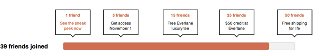

# Genius Launch

[Everlane](http://www.everlane.com/i/f8leoo) is a new startup that started here in San Francisco. They've done some ridiculously smart things with their launch.

> With Everlane we've set out to build a new kind of retail experience, one that exists 100% online and bypasses all the middlemen to create beautiful designer goods, always under $100.

It's basically super high quality designer goods (clothes, ties, bags, etc). I kinda want all of it.

## Genius Part

So besides having stuff that I really want and a great design, they have a ==brilliant social sharing incentive==.

It's simple really. If you want to see more, you have to [invite friends](http://www.everlane.com/i/f8leoo) to get access. You only need to invite one. Simple as that.

If you want more awesome stuff like early access, a ==[free shirt](http://www.everlane.com/i/f8leoo)==, a $50 credit, or free shipping for life, you just need to get more friends to join. ==This is so smart.==

Retweet contests and such are stupid. Usually it's an iPad for a prize. Apple [sold 11.2 million iPads last quarter](http://daringfireball.net/linked/2011/10/18/aapl-q4-2011). I already have one. It's so much better to simply invite my friends to something intriguing and pretty to get stuff that I can't get without inviting people and it's stuff that I really want.

Anyway, I was impressed. You should [check it out](http://www.everlane.com/i/f8leoo) and experience this really great idea.

And yes this post was partly so I could [see this](http://soff.me/BMiF). I'm okay with that.
