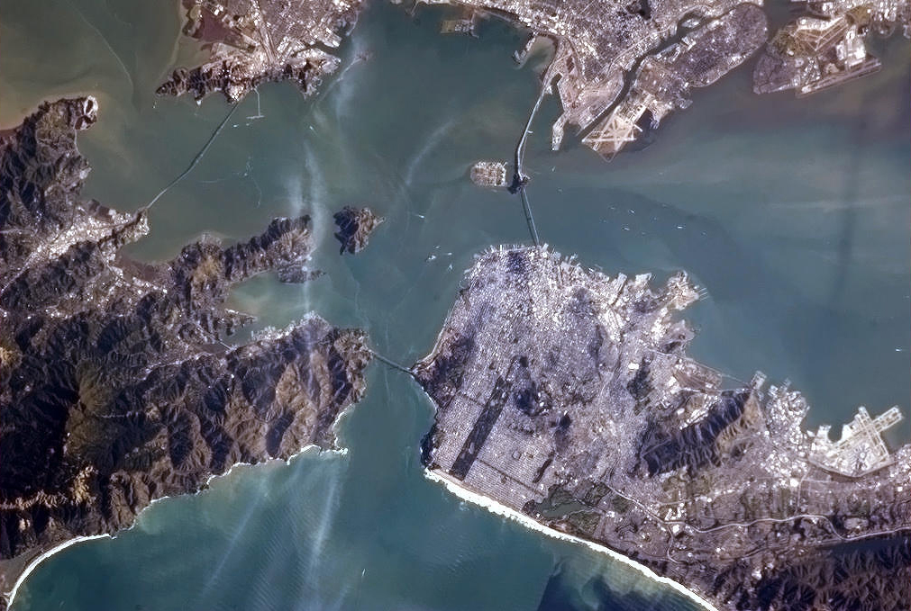

# Space

I recently realized I kinda like space. A lot.

I started following [Chris Hadfield](http://twitter.com/cmdr_hadfield) on Twitter a few months ago. Someone had retweeted [this tweet](https://twitter.com/Cmdr_Hadfield/status/294535736621936642) that had an amazing photo of San Francisco.

So amazing. (This picture is actually my cover picture on Facebook, Twitter, etc.) Anyway, I started reading more about Chris and these amazing photos. He posts [tons of photos](https://twitter.com/Cmdr_Hadfield/media/grid).

Chris lived on the [International Space Station](http://en.wikipedia.org/wiki/Iss) until really recently. The ISS alone is super fascinating. A bunch of governments worked together to put this awesome laboratory in space. That alone is impressive.

People have been living in this thing for years. (Well not the same people, but it has been inhabited continually.) A giant arm assembled modular pieces that different countries built. A day after it was in space, people started living in it. The astronauts aboard see a sunrise ever 90 minutes.

All of this is super fascinating. ==Imagine the engineering challenges to do something like this.== Say you wanted to go to space, where would you begin?

I work by iteration. ==Everything I do is trial and error.== I can't imagine building this ridiculous thing for people to live *in space*, launch it, and then hope it all works. If you mess up, people die. Crazy.

There is a ton of really interesting stuff going on. [Watch some of his videos](https://www.youtube.com/user/canadianspaceagency) or the [NASA videos](https://www.youtube.com/user/NASAtelevision). I could sit there for hours and watch these. Seriously, go watch a few.

I think Chris' tweets and Elon Musk's [SpaceX](http://spacex.com) have made me a space fan. After researching all of this, I discovered ==I really enjoy learning==. All of this stuff, is for the heck of it. None of this is useful at all, but I love it.

Anyway, go learn something. It will make your day better.

