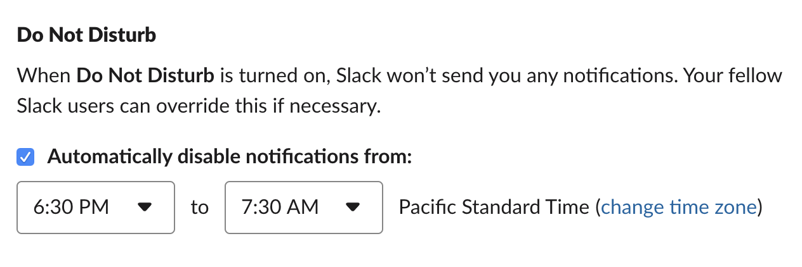

# Work-Life Balance

A friend recently complimented me on my work-life balance. This is definitely something I put some effort into figuring out when I first started working at a large company. It was pretty neat to get feedback that I was doing this well versus that I’m too disconnected, etc. Here’s what I’ve been doing that works for me.

## Contexts

One of my main drives for joining a company was not working from home any more. Having to physically go to the office helps me really keep things separate. I want to show up, get a lot done, go home, and not think about work at all. ==Having separate work and life contexts helps you focus on each.==

==I almost never take my work computer home. It belongs at work.== I also only work from home if absolutely necessary. Being at the office makes me more productive and helps me turn off work when I’m done on my [ride](https://twitter.com/soffes/status/1070723698112385025) home. I don’t do any work on my personal computer.

On my phone, ==I separate my work content into separate apps.== For example, I use Apple Mail for my personal email and Google Inbox for my work email. (We’ll talk about notifications in a minute.) Not seeing a work email mixed in with my list of personal email is key.

Stumbling across a difficult work email after a rough day is the last thing you need or want. Keep it separate.

I have all of my work apps in their only folder on my second home screen. After hours and on the weekend, I do my best not to open it. When I’m on vacation, I usually delete everything in this folder.

## Notifications

Controlling notifications is really important. It definitely falls into the context category above, but I think it’s worth expanding on this.

==Turn off all work alert notifications on your phone. Only use badges.== The only notifications I get are Calendar and Slack DMs. This is purely for coordinating in person meetups in the office if I’m away from my desk. (I only have Calendar notifications on my Apple Watch.) For Slack, I use Do Not Disturb aggressively.

If I’m not at the office, there’s no reason for someone to get in touch with me immediately. If I scroll over to my work folder and see a badge, I can choose to find out what it is or ignore it until the next day. I can’t think of a time where someone needed the answer right away. The first thought is you’re blocking someone and you need to answer right away, but in reality they are likely just leaving anyway and won’t read your reply until the next day anyway.

## Office Hours

I have pretty strict hours I’m in the office. I set these for myself. The company and my manager don’t care when I’m in the office. When I first started, I was all over the place. Sometimes I’d arrive at 10:30am and leave at 7:30pm. Part of the goal of work-life balance is life outside of work. ==You need to leave work to have work-life balance.==

I generally arrive between 7:30am and 9am (skewing more towards 8am). Since I pay a few dollars for motorcycle parking at the office, I only ever pay for parking until 6pm. This is a good forcing function to leave when it’s time to go home. I can only think of a few occasions I’ve extended it and it was usually for a social event with work friends after work.

Arriving relatively early makes it easier to leave early. I also get so much done before 11am since most people arrive between 9:30 and 10:30 and are still getting settled in until 11. This is a great time to catch up on all of the work email I’ve received since I left the previous evening.

## Final Thoughts

For me, having this separation and actively defending it is really important to me. If you do one thing from this, I’d recommend splitting your apps so you can control your notifications. I hope this was helpful.

Also, no judgement if you do something different! This is just what works for me.

Now go live life!
