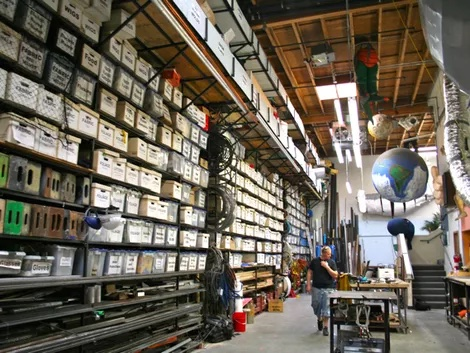

# Deep Hobbies

When I get into something, I really get into it. I love going deep on new hobbies and learning everything there is to know about them.

I think about the shop from MythBusters all the time. Shelves and shelves of labeled boxes of everything you could ever need to make stuff. Living the dream.

I’d say I’m not a hoarder or anything. I don’t really like collecting stuff or having just for the sake of it, but completing a set of gear to do a thing is definitely something I’m into.

I have labeled boxes of stuff for watchmaking all the way to scuba diving. It’s so wonderful to be able to have a closet full of toys that enable creativity.

Lately, I’ve been thinking a lot about downsizing my living situation and possessions in general. It’s a bit sad to think about getting rid of some of these collections of gear I spent so much researching and assembling. On the other hand, it’s just stuff.

Last year, I built a PC. I spent awhile researching components for the things I wanted to do with it, buying them, and constantly refreshing the delivery status everyday until they all arrived.

It was so fun to do all of that, assemble it, and get everything setup. After doing that, it felt kinda done. It was right at the beginning of the pandemic. After spending all day in my office during the day working, I didn’t want to spend more time at my desk on a different computer. I eventually sold it to a friend that is getting a lot of enjoyment out of it.

Later, I joked with my friend that bought it that after I assembled it, “I beat the game”. The process of researching and assembling it was the thing I actually wanted to do. I didn’t really want to play games on it.

Working on renovating my house has been this to the extreme. There are *so many* things to research, purchase, and assemble. ==I’m loving it.==

I’m actually really looking forward to selling my house when I’m done and doing it again. I didn’t plan to “flip” this house when I bought it, but things change.

I guess all I’m trying to say is, it took me awhile to appreciate the process of learning something. Picking up a new skill is so rewarding. Learning how to do something new is almost as much fun as doing the thing for me.

Life is good.

