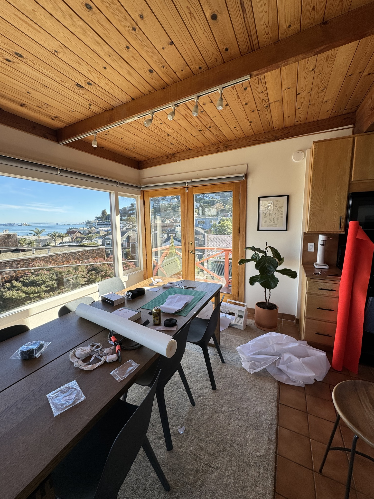
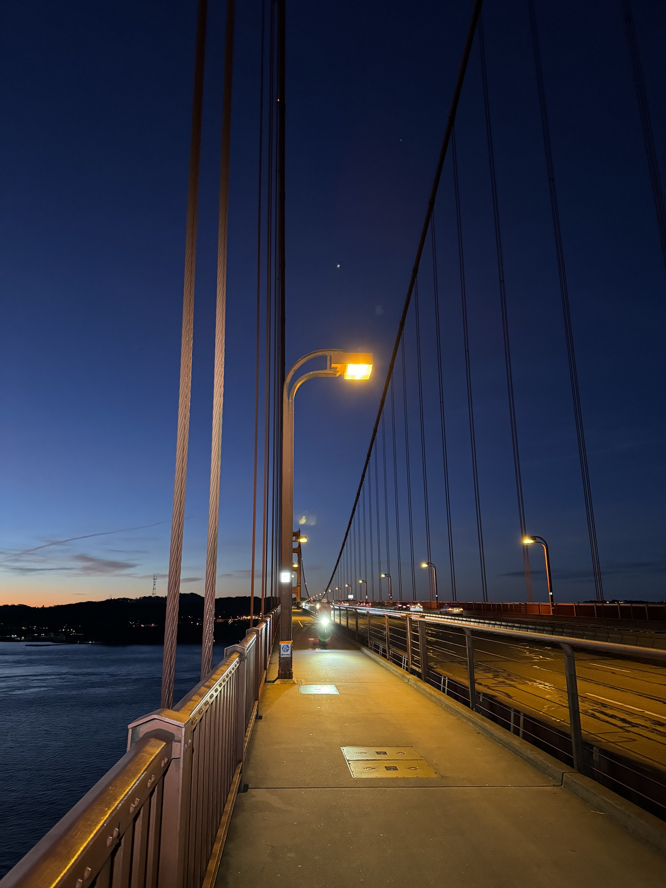
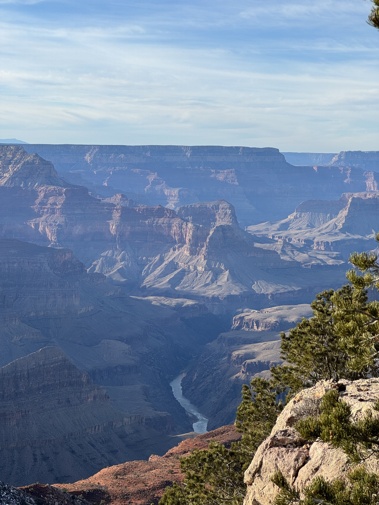
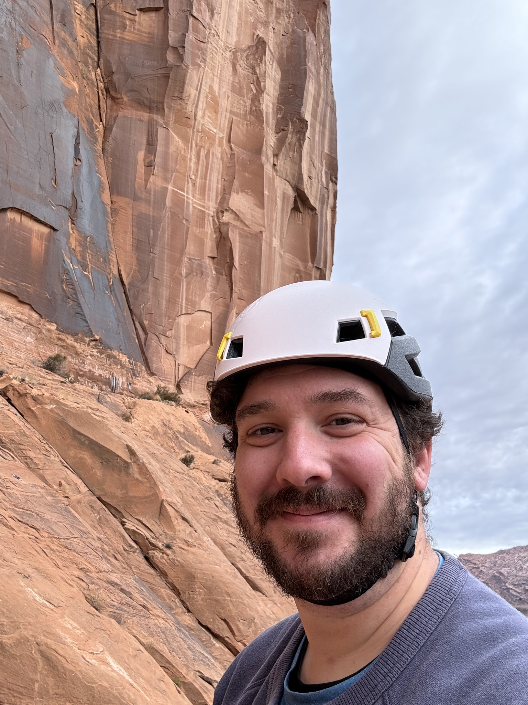
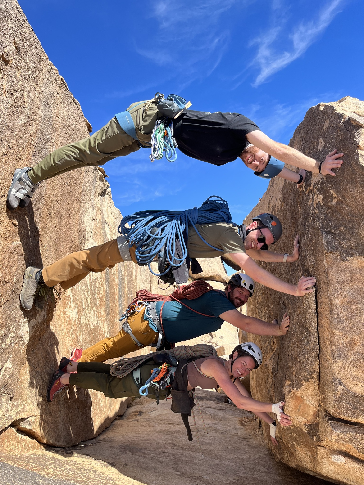
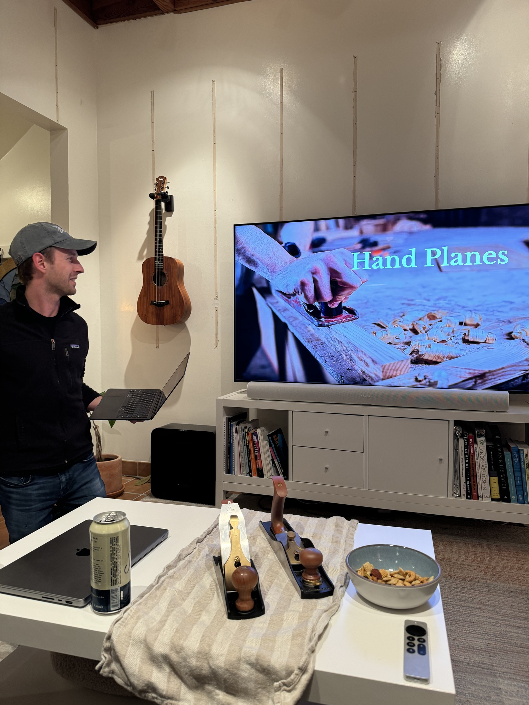
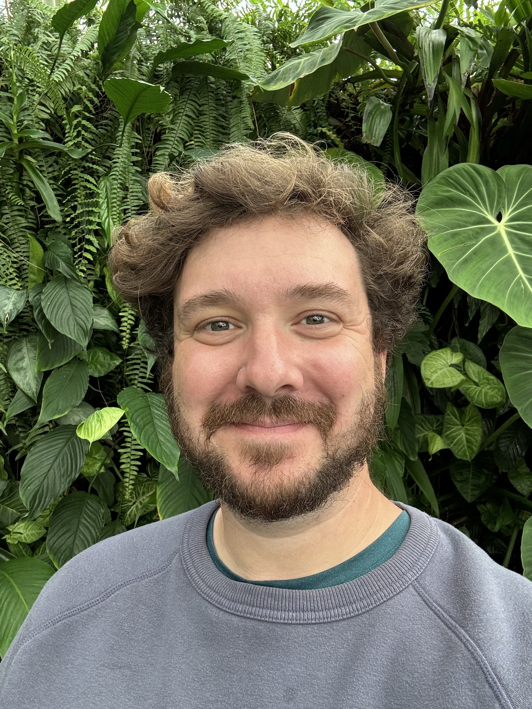
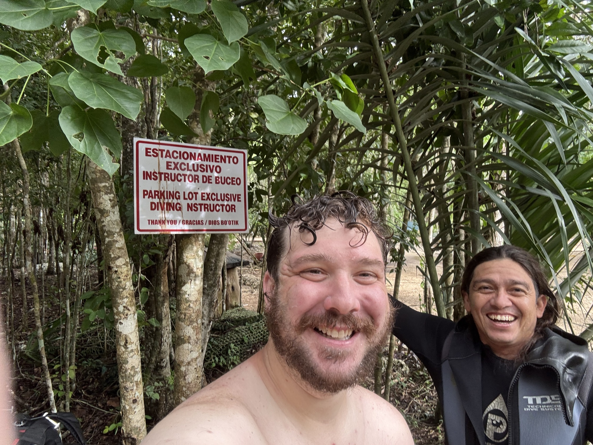
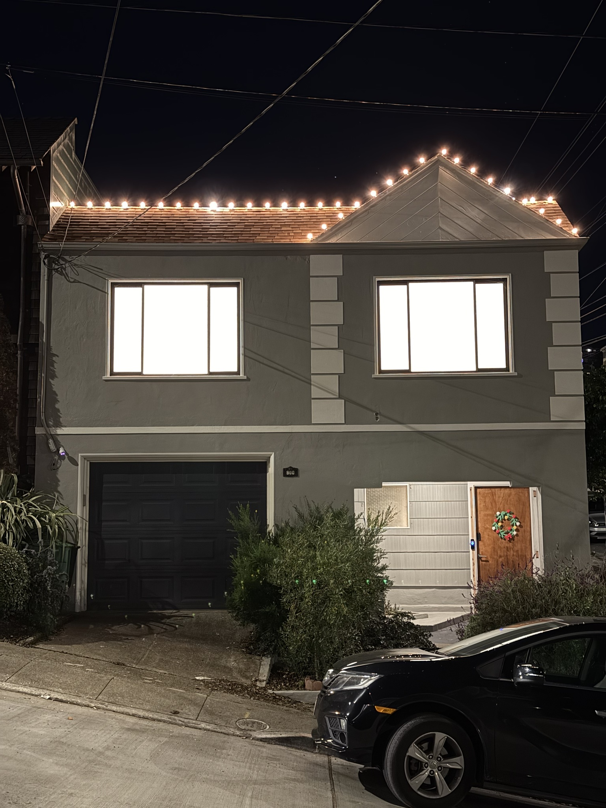
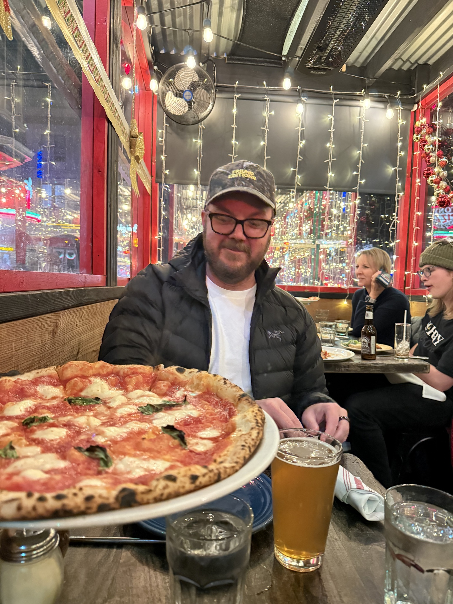

# 2024

Compared to the past 2 years, it feels like I didn’t do very much this year. Looking back on the year, I did quite a bit I suppose :)

For Christmas 2023, I drove to Kentucky, left my van for a few days, and flew back to San Francisco for New Year’s.

## January

Started out the year in my rental in Sausalito. That place had such an amazing view.

<photo-row>
  
  
  
</photo-row>

I really enjoyed biking from Sausalito to the climbing gym in the Presidio while I lived there.

<photo-row>
  
  
</photo-row>

In the first week of January, I flew back to get my van in Kentucky and then picked a San Francisco climb friend, Hunter, in Atlanta. We planned a few weeks to van and climb out way back to San Francisco from the East Coast. What a trip.

<photo-row>
  
  
  
</photo-row>

<photo-row>
  
</photo-row>

We spent a few days in Moab towards the end of the trip. Absolutely incredible. I definitely want to go back.

<photo-row>
  
  
  
</photo-row>

<photo-row>
  
</photo-row>

At the end of January, the climbing crew went to Joshua Tree to do some climbing.

<photo-row>
  
</photo-row>

<photo-row>
  
  
</photo-row>

<photo-row>
  
</photo-row>

<photo-row>
  
  
</photo-row>

<photo-row>
  
</photo-row>

## February

In February, I hosted a Keynote party. We all prepared a few minute presentation and gave it to the group. So fun! Mine was called "How to Not Die While Cave Diving". Andrew's "Hand Planes" was incredible.

<photo-row>
  
  
</photo-row>

<photo-row>
  
  
</photo-row>

Saw Apple Vision Pro for the first time with my friend, Max. Neat to see it after a few friends worked on it for so many years.

<photo-row>
  
  
</photo-row>

During my one of my last weeks of unemployment, my friends, Granger and Cass, visited. We had such a good time seeing a bunch of nature in Marin and some museums in the city.

<photo-row>
  
  
  
</photo-row>

Mid-February, I started a job at Apple on the Podcasts team. Super fortunate to be working in San Francisco and not Cupertino. It's been really interesting seeing behind the scenes on so many things I've worked with all of my career.

<photo-row>
  
</photo-row>

The very next day, I bought a house in Noe Valley, San Francisco. Big moves!

<photo-row>
  
</photo-row>

It has a spot in the back to park my van! So wild to have such a good spot for it in the city. Really excited about this.

<photo-row>
  
</photo-row>

## March

So great to have a place to play music with friends now.

<photo-row>
  
  
</photo-row>

For my birthday in March, the climbing crew did an escape room. Super fun!

<photo-row>
  
</photo-row>

## April

I've always wanted a hot tub. My last place actually had one, but it didn't work. So close haha. Now that I have a place with space for one, I bought one. It's so silly. I don't use it that much, but I really like it.

<photo-row>
  
  
  
</photo-row>

## April–May

My fence has these lattice panels. I plan to cover the entire fence with wood slats at some point, but for now, I made these canvas panels on the sewing machine to add some more privacy to the back yard.

<photo-row>
  
  
</photo-row>

With that out of the way, I built an outdoor shower on my weird shed things. Excellent for before and after the hot tub.

<photo-row>
  
  
</photo-row>

## June–July

Mid-July, I started a multi-month remodel. This time, I decided to hire people since I'm working. When I remodeled my last place, it took 2 years of all of my free time.

This was all encompassing until mid-November. I'll gloss over all of the details of the remodel. Maybe I'll write up something about it in 2025. The classic, "I'll starting writing more—for real this time".

During this whole time, I lived in the van in my backyard and showered in the outdoor shower everyday. Pretty nice to have a backup house!

<photo-row>
  
  
</photo-row>

## August

Mixed in there were some Monterey weekends for diving. Paul and Andrew are the best dive buddies.

<photo-row>
  
</photo-row>

Over the summer, I worked on some van projects too. So nice to have a place to work on things now! The big one was a new A/C on the roof. I don't use it a ton, but when I do it's so nice to have!

<photo-row>
  
  
  
  
</photo-row>

On a random Tuesday, my friend, Aaron, wanted to go to Yosemite. We drove there, hiked a bunch, and drove back in one day. That's a lot of driving, but we had such a good time. Gosh it's beautiful there!

<photo-row>
  
  
</photo-row>

<photo-row>
  
</photo-row>

<photo-row>
  
</photo-row>

In late August, I went back to Tulum to go cave diving with my friend, Michel. The caves there are so so beautiful!

<photo-row>
  
  
</photo-row>

<photo-row>
  
</photo-row>

<photo-row>
  
</photo-row>

<photo-row>
  
</photo-row>

<photo-row>
  
</photo-row>

<photo-row>
  
</photo-row>

## September

In September, Andrew and I did our first multi-pitch climb in Tahoe. What an incredible experience. Definitely want to go back and do more multi-pitch in 2025!

<photo-row>
  
  
</photo-row>

<photo-row>
  
  
  
</photo-row>

## October

I finally moved back into my house at the end of October. Overall, I'm really happy with the result. There are lots of things that could be improved or that I still need to fix. I love a good project though :)

<photo-row>
  
  
</photo-row>

## November

Now that I can live in the house again, I make stuff again! 3D printed a neat LEGO wreath for my front door. So fun!

<photo-row>
  
  
</photo-row>

<photo-row>
  
</photo-row>

I also designed and 3D printed a bracket to mount my bike lights on my commuter bike. That was a few rounds of iteration and the first time I've designed a part that uses captive nuts. Pretty proud of this! (You can also see my electrical panel is one of those upcoming house projects 😅)

<photo-row>
  
</photo-row>

I also cooked Thanksgiving food for the first time. It was just me and Paul, but we had a great time. Cranberry sauce from a can—the only reasonable way to eat it.

<photo-row>
  
  
</photo-row>

## December

In San Francisco, it rains a bunch in the winter. After the remodel, my roof was leaking. After getting over my fear of getting on my roof to fix that, I decided to put up some lights. I'm really happy with how they turned out. Will have to add some to my bushes, etc. next year.

Like a real nerd, I used my climbing gear to rappel a little to get the lights near the gutter so I wouldn't fall off of the roof. Extremely satisfying to use my climbing gear on my roof for some reason 😂

<photo-row>
  
  
</photo-row>

I always joke that Devin is my only single friend. He and I went to a magic show and then a comedy show towards the end of the year. Always so fun to go on a friend date!

<photo-row>
  
</photo-row>

## Onward

Overall 2024 was a great year. The big contrast to the past 2 years was really jarring at first, but I'm really happy to be where I am. So many adventures and positives things this year. Excited for many more in 2025.
